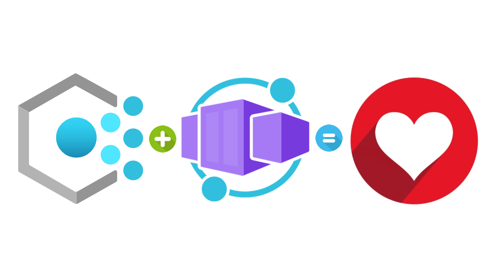
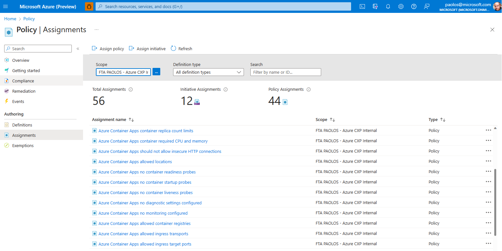

# Azure Policy for Azure Container Apps

This repository contains [Azure Policy](https://learn.microsoft.com/en-us/azure/governance/policy/overview) custom definitions for [Azure Container Apps](https://learn.microsoft.com/en-us/azure/container-apps/overview). Any contribution is more than welcome. Feel free to submit a pull request to add or update custom policy definitions.

<p align="center">
  
</p>

## Azure Governance

[Azure Governance](https://learn.microsoft.com/en-us/azure/governance/) is a set of mechanisms, services, and processes that allow users to maintain control over their applications and resources in Microsoft Azure. For more information, see [What are the Azure Management areas?](https://learn.microsoft.com/en-us/azure/governance/azure-management). Azure Governance is designed to help organizations plan their initiatives, set strategic priorities, and manage their resources effectively. It provides a centralized way to manage policies, compliance, and security across all Azure services. For more information, see the [Standard enterprise governance guide](https://learn.microsoft.com/en-us/azure/cloud-adoption-framework/govern/guides/standard/) and [Governance guide for complex enterprises](https://learn.microsoft.com/en-us/azure/cloud-adoption-framework/govern/guides/complex/) under the documentation for the [Microsoft Cloud Adoption Framework for Azure](https://learn.microsoft.com/en-us/azure/cloud-adoption-framework/overview).

Azure Governance is important because it helps organizations ensure that their resources are being used in a cost-effective and compliant manner. By providing a unified view of resources and policies, Azure Governance enables users to manage their applications and resources more efficiently and securely. In addition, Azure Governance helps organizations reduce costs and improve security by providing a centralized location for managing policies and security controls.

One of the key features of [Azure Governance](https://learn.microsoft.com/en-us/azure/governance/) is the ability to create hierarchies and assign [Azure Policy](https://learn.microsoft.com/en-us/azure/governance/policy/overview) built-in and custom definitions to a hierarchy of management groups, subscriptions, or resource groups. For more information, see [Azure Policy definition structure](https://learn.microsoft.com/en-us/azure/governance/policy/concepts/definition-structure). This allows users to manage their resources at scale and enforce policies across multiple environments. Another important feature of [Azure Governance](https://learn.microsoft.com/en-us/azure/governance/) is the ability to implement policy-based management for all Azure services using [Azure Policy](https://learn.microsoft.com/en-us/azure/governance/policy/overview). Azure Policy allows users to define and enforce policies across all their resources in Azure, ensuring that their resources are compliant with company policies and industry standards.

[Azure Policy](https://learn.microsoft.com/en-us/azure/governance/policy/overview) is vital in ensuring and enforcing compliance for [Azure Container Apps](https://learn.microsoft.com/en-us/azure/container-apps/overview). By using [Azure Policy](https://learn.microsoft.com/en-us/azure/governance/policy/overview), organizations can create and enforce policies that govern container image sources, image content, and container configurations, among other things. These policies can be used to ensure that all containers used within an organization adhere to the required security and compliance standards. Azure Policy also provides pre-built policies specifically designed for Azure Container Apps, which can be easily customized and deployed by organizations. For more information, see [Azure Policy built-in definitions for Azure Container Apps](https://learn.microsoft.com/en-us/azure/container-apps/policy-reference).

## Azure Policy built-in definitions for Azure Container Apps

The following table is an index of the [Azure Policy](https://learn.microsoft.com/en-us/azure/governance/policy/overview) built-in policy definitions for [Azure Container Apps](https://learn.microsoft.com/en-us/azure/container-apps/overview). For additional Azure Policy built-ins for other services, see [Azure Policy built-in definitions](https://learn.microsoft.com/en-us/azure/governance/policy/samples/built-in-policies).

The name of each built-in policy definition links to the policy definition in the Azure portal. Use the link in the **Version** column to view the source on the [Azure Policy GitHub repo](https://github.com/Azure/azure-policy).

|Name|Description|Effect(s)|Version|
|---|---|---|---|
|[Authentication should be enabled on Container Apps](https://portal.azure.com/#blade/Microsoft_Azure_Policy/PolicyDetailBlade/definitionId/%2Fproviders%2FMicrosoft.Authorization%2FpolicyDefinitions%2F2b585559-a78e-4cc4-b1aa-fb169d2f6b96) |Container Apps Authentication is a feature that can prevent anonymous HTTP requests from reaching the Container App, or authenticate those that have tokens before they reach the Container App |AuditIfNotExists, Disabled |[1.0.1](https://github.com/Azure/azure-policy/blob/master/built-in-policies/policyDefinitions/Container%20Apps/ContainerApps_EnableAuth_AuditIfNotExists.json) |
|[Container App environments should use network injection](https://portal.azure.com/#blade/Microsoft_Azure_Policy/PolicyDetailBlade/definitionId/%2Fproviders%2FMicrosoft.Authorization%2FpolicyDefinitions%2F8b346db6-85af-419b-8557-92cee2c0f9bb) |Container Apps environments should use virtual network injection to: 1.Isolate Container Apps from the public internet 2.Enable network integration with resources on-premises or in other Azure virtual networks 3.Achieve more granular control over network traffic flowing to and from the environment. |Audit, Disabled, Deny |[1.0.2](https://github.com/Azure/azure-policy/blob/master/built-in-policies/policyDefinitions/Container%20Apps/ContainerApps_InjectVNet_Audit.json) |
|[Container App should configure with volume mount](https://portal.azure.com/#blade/Microsoft_Azure_Policy/PolicyDetailBlade/definitionId/%2Fproviders%2FMicrosoft.Authorization%2FpolicyDefinitions%2F7c9f3fbb-739d-4844-8e42-97e3be6450e0) |Enforce the use of volume mounts for Container Apps to ensure availability of persistent storage capacity. |Audit, Deny, Disabled |[1.0.1](https://github.com/Azure/azure-policy/blob/master/built-in-policies/policyDefinitions/Container%20Apps/ContainerApps_ContainerAppMountStorage_Audit.json) |
|[Container Apps environment should disable public network access](https://portal.azure.com/#blade/Microsoft_Azure_Policy/PolicyDetailBlade/definitionId/%2Fproviders%2FMicrosoft.Authorization%2FpolicyDefinitions%2Fd074ddf8-01a5-4b5e-a2b8-964aed452c0a) |Disable public network access to improve security by exposing the Container Apps environment through an internal load balancer. This removes the need for a public IP address and prevents internet access to all Container Apps within the environment. |Audit, Deny, Disabled |[1.0.1](https://github.com/Azure/azure-policy/blob/master/built-in-policies/policyDefinitions/Container%20Apps/ContainerApps_EnvironmentInternal_Audit.json) |
|[Container Apps should disable external network access](https://portal.azure.com/#blade/Microsoft_Azure_Policy/PolicyDetailBlade/definitionId/%2Fproviders%2FMicrosoft.Authorization%2FpolicyDefinitions%2F783ea2a8-b8fd-46be-896a-9ae79643a0b1) |Disable external network access to your Container Apps by enforcing internal-only ingress. This will ensure inbound communication for Container Apps is limited to callers within the Container Apps environment. |Audit, Deny, Disabled |[1.0.1](https://github.com/Azure/azure-policy/blob/master/built-in-policies/policyDefinitions/Container%20Apps/ContainerApps_ContainerAppInternal_Audit.json) |
|[Container Apps should only be accessible over HTTPS](https://portal.azure.com/#blade/Microsoft_Azure_Policy/PolicyDetailBlade/definitionId/%2Fproviders%2FMicrosoft.Authorization%2FpolicyDefinitions%2F0e80e269-43a4-4ae9-b5bc-178126b8a5cb) |Use of HTTPS ensures server/service authentication and protects data in transit from network layer eavesdropping attacks. Disabling 'allowInsecure' will result in the automatic redirection of requests from HTTP to HTTPS connections for container apps. |Audit, Deny, Disabled |[1.0.1](https://github.com/Azure/azure-policy/blob/master/built-in-policies/policyDefinitions/Container%20Apps/ContainerApps_EnableHTTPS_Audit.json) |
|[Managed Identity should be enabled for Container Apps](https://portal.azure.com/#blade/Microsoft_Azure_Policy/PolicyDetailBlade/definitionId/%2Fproviders%2FMicrosoft.Authorization%2FpolicyDefinitions%2Fb874ab2d-72dd-47f1-8cb5-4a306478a4e7) |Enforcing managed identity ensures Container Apps can securely authenticate to any resource that supports Azure AD authentication |Audit, Deny, Disabled |[1.0.1](https://github.com/Azure/azure-policy/blob/master/built-in-policies/policyDefinitions/Container%20Apps/ContainerApps_ManagedIdentity_Audit.json) |

## Azure Policy custom definitions for Azure Container Apps

The following table is an index of the [Azure Policy](../governance/policy/overview.md) custom policy definitions for [Azure Container Apps](https://learn.microsoft.com/en-us/azure/container-apps/overview) contained in this repository. Use the link in the **Version** column to view the source on the [Azure Policy GitHub repo](https://github.com/Azure/azure-policy).

|Name|Description|Effect(s)|Version|
|---|---|---|---|
Azure Container Apps allowed container registries| Restrict the list of container registries for Azure Container Apps|Audit, Deny, Disabled |[1.0.0](./policy-definitions/aca-allowed-container-registries.json)|
Azure Container Apps allowed ingress target ports|Restrict the list of ingress target ports for Azure Container Apps|Audit, Deny, Disabled |[1.0.0](./policy-definitions/aca-allowed-ingress-target-ports.json)|
Azure Container Apps allowed ingress transports|Restrict the list of ingress transports for Azure Container Apps|Audit, Deny, Disabled |[1.0.0](./policy-definitions/aca-allowed-ingress-transports.json)|
Azure Container Apps allowed locations|Restrict the locations for Azure Container Apps|Audit, Deny, Disabled |[1.0.0](./policy-definitions/aca-allowed-locations.json)|
Azure Container Apps should not allow insecure HTTP connections|Specify whether Azure Container Apps should not allow insecure HTTP connections|Audit, Deny, Disabled |[1.0.0](./policy-definitions/aca-insecure-connections.json)|
Azure Container Apps no diagnostic settings configured|When the environment configure to collect logs and metrics to Azure Monitor, checks whether diagnostic settings have been defined|AuditIfNotExists, Disabled|[1.0.0](./policy-definitions/aca-no-diagnostic-settings.json)|
Azure Container Apps no container readiness probes|Enforce that all the containers of Azure Containers Apps have readiness probes configured|Audit, Deny, Disabled |[1.0.0](./policy-definitions/aca-no-readiness-probes.json)|
Azure Container Apps no container startup probes|Enforce that all the containers of Azure Containers Apps have startup probes configured|Audit, Deny, Disabled |[1.0.0](./policy-definitions/aca-no-startup-probes.json)|
Azure Container Apps no monitoring configured |Enforce that monitoring is configured for Azure Container Apps environments|Audit, Deny, Disabled |[1.0.0](./policy-definitions/aca-no-monitoring.json)|
Azure Container Apps container replica count limits|Enforce limits for the minimum and maximum number of replicas for Azure Container Apps|Audit, Deny, Disabled |[1.0.0](./policy-definitions/aca-replica-count.json)|
Azure Container Apps container required CPU and memory|Enforce limits for container CPU and memory requests in an AZure Container App.|Audit, Deny, Disabled |[1.0.0](./policy-definitions/aca-replica-count.json)|

In general, the default effect for all the above custom policy definitions is [Audit](https://learn.microsoft.com/en-us/azure/governance/policy/concepts/effects#audit). Audit is used to create a warning event in the activity log when evaluating a non-compliant resource, but it doesn't stop the request. You can change the effect to [Deny](https://learn.microsoft.com/en-us/azure/governance/policy/concepts/effects#deny) if you want to avoid creating or updating an environment or application when they match the conditions defined in the policy definition and let the request fail.

## Deployment

In the [bicep](./bicep/) folder you can find the following Bicep modules that you can use to deploy the custom policy definitions to your subscription. If you need to deploy the policies to a management group, you can modify the `targetScope` to `managementGroup` in the Bicep modules. For more information, see [Management group deployments with Bicep files](https://learn.microsoft.com/en-us/azure/azure-resource-manager/bicep/deploy-to-management-group?tabs=azure-cli).

### main.bicep

```bicep
// Scope
targetScope = 'subscription'

// Parameters
@description('Specifies the location of the deployment.')
param location string

@description('List of policy definitions')
param policies array = [
  {
    name: 'aca-insecure-connections'
    definition: json(loadTextContent('../policy-definitions/aca-insecure-connections.json'))
    parameters: {
      effect: {
        value: 'Audit'
      }
    }
    identity: false
  }
  {
    name: 'aca-allowed-locations'
    definition: json(loadTextContent('../policy-definitions/aca-allowed-locations.json'))
    parameters: {
      listOfAllowedLocations: {
        value: [
          'northeurope'
          'westeurope'
          'eastus2'
        ]
      }
      effect: {
        value: 'Audit'
      }
    }
    identity: false
  }
  {
    name: 'aca-allowed-container-registries'
    definition: json(loadTextContent('../policy-definitions/aca-allowed-container-registries.json'))
    parameters: {
      listOfAllowedContainerRegistries: {
        value: [
          'mcr.microsoft.com'
          'docker.io'
          'dapriosamples'
        ]
      }
      effect: {
        value: 'Audit'
      }
    }
    identity: false
  }
  {
    name: 'aca-allowed-ingress-target-ports'
    definition: json(loadTextContent('../policy-definitions/aca-allowed-ingress-target-ports.json'))
    parameters: {
      listOfAllowedIngressTargetPorts: {
        value: [
          443
          80
        ]
      }
    }
    identity: false
  }
  {
    name: 'aca-allowed-ingress-transports'
    definition: json(loadTextContent('../policy-definitions/aca-allowed-ingress-transports.json'))
    parameters: {
      listOfAllowedIngressTransports: {
        value: [
          'http'
          'http2'
          'auto'
        ]
      }
      effect: {
        value: 'Audit'
      }
    }
    identity: false
  }
  {
    name: 'aca-replica-count'
    definition: json(loadTextContent('../policy-definitions/aca-replica-count.json'))
    parameters: {
      minReplicas: {
        value: 0
      }
      maxReplicas: {
        value: 30
      }
      effect: {
        value: 'Audit'
      }
    }
    identity: false
  }
  {
    name: 'aca-no-liveness-probes'
    definition: json(loadTextContent('../policy-definitions/aca-no-liveness-probes.json'))
    parameters: {
      effect: {
        value: 'Audit'
      }
    }
    identity: false
  }
  {
    name: 'aca-no-readiness-probes'
    definition: json(loadTextContent('../policy-definitions/aca-no-readiness-probes.json'))
    parameters: {
      effect: {
        value: 'Audit'
      }
    }
    identity: false
  }
  {
    name: 'aca-no-startup-probes'
    definition: json(loadTextContent('../policy-definitions/aca-no-startup-probes.json'))
    parameters: {
      effect: {
        value: 'Audit'
      }
    }
    identity: false
  }
  {
    name: 'aca-required-cpu-and-memory'
    definition: json(loadTextContent('../policy-definitions/aca-required-cpu-and-memory.json'))
    parameters: {
      maxCpu: {
        value: '1.0'
      }
      maxMemory: {
        value: '2.5'
      }
      effect: {
        value: 'Audit'
      }
    }
    identity: false
  }
  {
    name: 'aca-no-monitoring'
    definition: json(loadTextContent('../policy-definitions/aca-no-monitoring.json'))
    parameters: {
      effect: {
        value: 'Audit'
      }
    }
    identity: false
  }
  {
    name: 'aca-no-diagnostic-settings'
    definition: json(loadTextContent('../policy-definitions/aca-no-diagnostic-settings.json'))
    parameters: {
      logsEnabled: {
        value: true
      }
      metricsEnabled: {
        value: true
      }
      effect: {
        value: 'AuditIfNotExists'
      }
    }
    identity: false
  }
]

resource policyDefinition 'Microsoft.Authorization/policyDefinitions@2021-06-01' = [for policy in policies: {
  name: guid(policy.name)
  properties: {
    description: policy.definition.properties.description
    displayName: policy.definition.properties.displayName
    metadata: policy.definition.properties.metadata
    mode: policy.definition.properties.mode
    parameters: policy.definition.properties.parameters
    policyType: policy.definition.properties.policyType
    policyRule: policy.definition.properties.policyRule
  }
}]

module policyAssignment './assignment.bicep' = [for (policy, i) in policies: {
  name: 'poAssign_${take(policy.name, 40)}'
  params: {
    policy: policy
    location: location
    policyDefinitionId: policyDefinition[i].id
  }
  dependsOn: [
    policyDefinition
  ]
}]
```

### assignment.bicep

```bicep
// Scope
targetScope = 'subscription'

// Parameters
@description('Specifies the location of the deployment.')
param location string

@description('Specifies the policy definition to assign.')
param policy object

@description('Specifies the resource id of the policy definition to assign.')
param policyDefinitionId string

// Resources
resource policyAssignment 'Microsoft.Authorization/policyAssignments@2022-06-01' = {
  name: uniqueString('${policy.name}')
  location: location
  identity: {
    type: 'SystemAssigned'
  }
  properties: {
    description: policy.definition.properties.description
    displayName: policy.definition.properties.displayName
    policyDefinitionId: policyDefinitionId
    parameters: policy.parameters
  }
}

resource roleAssignment 'Microsoft.Authorization/roleAssignments@2022-04-01' = if (policy.identity) {
  name: guid('${policy.name}')
  properties: {
    roleDefinitionId: policy.policyDefinition.properties.policyRule.then.details.roleDefinitionIds[0]
    principalId: policyAssignment.identity.principalId
    principalType: 'ServicePrincipal'
  }
}

// Outputs
output policyAssignmentId string = policyAssignment.id
output principalId string = policyAssignment.identity.principalId

```

For more information on how to deploy Azure Policy custom definitions and assignments via Bicep, see the following resources:

- [Azure Policy : what if we use Bicep ?](https://charotamine.medium.com/azure-policies-deploy-and-test-with-bicep-bfa80082ec1)
- [How to deploy Azure Policy with Bicep?](https://erudinsky.com/2022/09/20/azure-policy-as-code-with-bicep/)

## Scripts

You can use the [deploy.sh](./scripts/deploy.sh) script under the [scripts](./scripts/) folder to deploy the custom policy definitions to your Azure subscription. Before deploying the policy definitions and assignments, make sure to customize the values of the policy parameters in the `main.bicep` module based on your needs.

```bash
#!/bin/bash

# Variables
location='westeurope'
deploymentName='policy-deployment'
template="../bicep/main.bicep"
parameters="../bicep/main.parameters.json"
whatIf=1
validate=1

# Subscription id, subscription name, and tenant id of the current subscription
subscriptionId=$(az account show --query id --output tsv)
subscriptionName=$(az account show --query name --output tsv)
tenantId=$(az account show --query tenantId --output tsv)

if [[ $validate == 1 ]]; then
  if [[ $whatIf == 1 ]]; then
    # Execute a deployment What-If operation at resource group scope.
    echo "Previewing changes deployed by [$template] Bicep template..."
    az deployment sub what-if \
      --name $deploymentName \
      --location $location \
      --template-file $template \
      --parameters $parameters \
      --parameters location=$location

    if [[ $? == 0 ]]; then
      echo "[$template] Bicep template validation succeeded"
    else
      echo "Failed to validate [$template] Bicep template"
      exit
    fi
  else
    # Validate the Bicep template
    echo "Validating [$template] Bicep template..."
    output=$(az deployment sub validate \
      --name $deploymentName \
      --location $location \
      --template-file $template \
      --parameters $parameters \
      --parameters location=$location)

    if [[ $? == 0 ]]; then
      echo "[$template] Bicep template validation succeeded"
    else
      echo "Failed to validate [$template] Bicep template"
      echo $output
      exit
    fi
  fi
fi 

# Deploy infrastructure
az deployment sub create \
  --name $deploymentName \
  --location $location \
  --template-file $template \
  --parameters $parameters \
  --parameters location=$location

if [[ $? == 0 ]]; then
  echo "[$deploymentName] deployment successfully created in the [$subscriptionName] subscription"
else
  echo "Failed to create [$deploymentName] deployment in the [$subscriptionName] subscription"
  exit -1
fi
```

## Verify the Deployment

Proceed as follows to verify that the custom policy definitions were successfully deployed and assigned to your Azure subscription as a target scope.

### Policy Definitions

- Open `Policy` in the Azure Portal
- Select `Definitions` under `Authoring`
- Select `Azure Container Apps` under the `Category` drop-down list
- Verify that you can see the policy definitions as shown in the following picture:


### Policy Assignments

- Open `Policy` in the Azure Portal
- Select `Assignments` under `Authoring`
- Verify that you can see the policy assignments as shown in the following picture:



## Custom Policy Definition

As an example, the following table contains the definition of the `Azure Container Apps allowed container registries` custom policy that enables you to restrict the list of container registries for [Azure Container Apps](https://learn.microsoft.com/en-us/azure/container-apps/overview).

```json
{
  "properties": {
    "displayName": "Azure Container Apps allowed container registries",
    "policyType": "Custom",
    "mode": "Indexed",
    "description": "This policy enables you to restrict the list of container registries for Azure Container Apps.",
    "metadata": {
      "version": "1.0.0",
      "category": "Azure Container Apps"
    },
    "parameters": {
      "listOfAllowedContainerRegistries": {
        "type": "Array",
        "metadata": {
          "displayName": "Allowed container registries",
          "description": "The list of container registries that can be specified when deploying resources."
        },
        "defaultValue": [
          "mcr.microsoft.com"
        ]
      },
      "effect": {
        "type": "String",
        "metadata": {
          "displayName": "Effect",
          "description": "Enable or disable the execution of the policy"
        },
        "allowedValues": [
          "Audit",
          "Deny",
          "Disabled"
        ],
        "defaultValue": "Audit"
      }
    },
    "policyRule": {
      "if": {
        "allOf": [{
            "field": "type",
            "equals": "Microsoft.App/containerApps"
          },
          {
            "count": {
              "field": "Microsoft.App/containerApps/template.containers[*]",
              "where": {
                "value": "[split(first(field('Microsoft.App/containerApps/template.containers[*].image')), '/')[0]]",
                "notIn": "[parameters('listOfAllowedContainerRegistries')]"
              }
            },
            "greater": 0
          }
        ]
      },
      "then": {
        "effect": "[parameters('effect')]"
      }
    }
  }
}
```

If you open the `Azure Container Apps allowed container registries` policy assignments, you can see the list of the parameters and their values, as shown in the following picture:


If you click `View Compliance` you can see a pie chart that indicates the number of compliant and non-compliant Azure Container Apps. The compliance state describes a resource's adherence to applicable policies. The state can be compliant, non-compliant, exempt, conflict, not started, or protected. If you select `Non-compliant` from the drop-down list, you can see the list of the Azure Container Apps that do not use container images from the list of allowed registries, as shown in the following picture:


If you click the `Details` link of a compliant or non-compliant resource, you can see the compliance details, as shown in the following picture:


For more information about Azure Policy compliance, see [Get compliance data of Azure resources](https://learn.microsoft.com/en-us/azure/governance/policy/how-to/get-compliance-data).

## Conclusion

In summary, [Azure Governance](https://learn.microsoft.com/en-us/azure/governance/) is a critical component of managing resources in Azure, such as [Azure Container Apps](https://learn.microsoft.com/en-us/azure/container-apps/overview). It provides a centralized way to manage policies, compliance, and security across all Azure services, enabling users to manage their resources more efficiently and securely. By using Azure Governance, organizations can reduce costs, improve security, and ensure compliance with industry standards and regulations. You can use the [Azure Policy built-in definitions for Azure Container Apps](https://learn.microsoft.com/en-us/azure/container-apps/policy-reference) or build your own custom definitions to implement your governance and compliance rules.